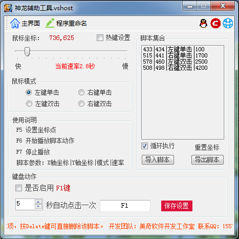

# 神龙辅助工具
### 开发语言：C#
### 开发工具：Microsoft Visual Studio 2010
## 软件简述：
神龙辅助工具是个非常实用的键盘鼠标脚本录制工具，通过它你可以轻松地进行脚本录制，简单易用，不需要任何编程知识就能做出功能强大的脚本，只要你在电脑前用双手可以完成的动作，神龙辅助工具都可以替你完成。
## 功能说明：
1. 一款简单的物理辅助外挂，可实现对鼠标和键盘的操作记录，从而实现自动点击。
2. 可以自定义快捷键，自定义速度频率。
3. 可以导入脚本和导出脚本。

默认按键：

F5 设置坐标点

F6 开始播放脚本动作

F7 停止播放

## 软件截图：

